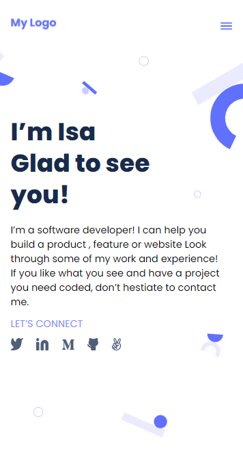

 
# Portfoilo

> A Simple Software Engineer Portfolio App Made with Vanilla HTML5, CSS3. The Project Contains a Showcase with Information About Me, All of My Works (Apps), and a Contact Form for Communication.



## Built With

- HTML5
- CSS3


## Getting Started

To get a local copy up and running follow these simple example steps.

```
git clone https://github.com/IsraMarvin/Portfolio.git
cd Portfolio
```

## Authors

👤 IsraMarvin

- GitHub: [@IsraMarvin](https://github.com/IsraMarvin)

## 🤝 Contributing

Contributions, issues, and feature requests are welcome!

Feel free to check the [issues page](../../issues/).

## Show your support

Give a ⭐️ if you like this project!

## Acknowledgments

- Hat tip to anyone whose code was used
- Inspiration
- etc

## 📝 License

This project is [MIT](./MIT.md) licensed.
